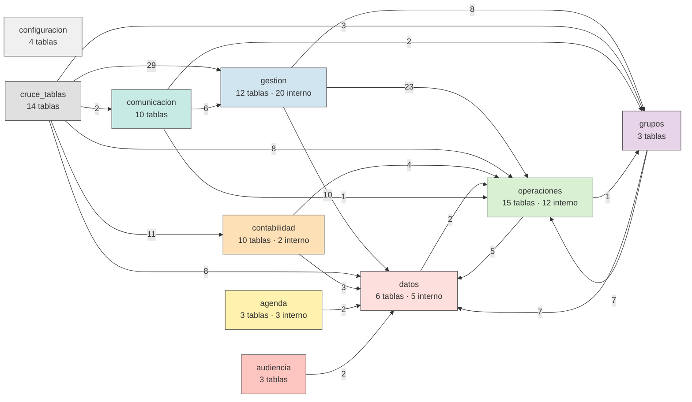

# Mapa de relaciones SGA — nuevo schema vs spec original AppSheet

Generado por `scripts/generar_diagrama_relaciones.py` desde `Base.metadata`.

## Comparación

| | Cantidad |
|---|---:|
| FKs en el schema nuevo | **186** |
| Relaciones del spec original (mapeadas) | 150 |
| 🟢 En ambos | **133** |
| 🔵 Solo en el nuevo | **53** |
| 🔴 Solo en el spec original | **17** |

**Leyenda:** 🟢 verde = en ambos · 🔵 azul = solo en el nuevo schema · 🔴 rojo punteado = solo en el spec original (brecha/colapsado/inverso)

## Vista 1 — Organigrama por schema



## Vista 2 — Grafo por tabla (agrupado por schema)

```mermaid
graph LR
  subgraph agenda_sg["agenda"]
    agenda__categoria["agenda.categoria"]
    agenda__obligacion["agenda.obligacion"]
    agenda__tarea["agenda.tarea"]
  end
  subgraph audiencia_sg["audiencia"]
    audiencia__hito_fidelizacion["audiencia.hito_fidelizacion"]
    audiencia__lead["audiencia.lead"]
  end
  subgraph comunicacion_sg["comunicacion"]
    comunicacion__com_cliente["comunicacion.com_cliente"]
    comunicacion__com_cobranza["comunicacion.com_cobranza"]
    comunicacion__com_comision["comunicacion.com_comision"]
    comunicacion__com_documento["comunicacion.com_documento"]
    comunicacion__com_liquidacion["comunicacion.com_liquidacion"]
    comunicacion__com_materia["comunicacion.com_materia"]
    comunicacion__com_otros["comunicacion.com_otros"]
    comunicacion__com_plan_pago["comunicacion.com_plan_pago"]
    comunicacion__com_poliza["comunicacion.com_poliza"]
    comunicacion__com_registro["comunicacion.com_registro"]
  end
  subgraph contabilidad_sg["contabilidad"]
    contabilidad__cartola["contabilidad.cartola"]
    contabilidad__cierre_mensual["contabilidad.cierre_mensual"]
    contabilidad__contable["contabilidad.contable"]
    contabilidad__cta_cte["contabilidad.cta_cte"]
    contabilidad__fecu["contabilidad.fecu"]
    contabilidad__fondo["contabilidad.fondo"]
    contabilidad__liquidacion["contabilidad.liquidacion"]
    contabilidad__pago_cliente["contabilidad.pago_cliente"]
    contabilidad__ppm["contabilidad.ppm"]
    contabilidad__presupuesto["contabilidad.presupuesto"]
  end
  subgraph cruce_tablas_sg["cruce_tablas"]
    cruce_tablas__coberturas_x_productos["cruce_tablas.coberturas_x_productos"]
    cruce_tablas__cuotas_x_cobranza["cruce_tablas.cuotas_x_cobranza"]
    cruce_tablas__documentos_x_comision["cruce_tablas.documentos_x_comision"]
    cruce_tablas__documentos_x_liquidacion["cruce_tablas.documentos_x_liquidacion"]
    cruce_tablas__facturas_x_comision["cruce_tablas.facturas_x_comision"]
    cruce_tablas__items_x_envio_cliente["cruce_tablas.items_x_envio_cliente"]
    cruce_tablas__materias_x_envio["cruce_tablas.materias_x_envio"]
    cruce_tablas__materias_x_registro["cruce_tablas.materias_x_registro"]
    cruce_tablas__notas_x_entidades["cruce_tablas.notas_x_entidades"]
    cruce_tablas__recotizaciones_x_poliza["cruce_tablas.recotizaciones_x_poliza"]
    cruce_tablas__registros_x_polizas["cruce_tablas.registros_x_polizas"]
    cruce_tablas__relaciones_ruts["cruce_tablas.relaciones_ruts"]
    cruce_tablas__seguros_x_cia["cruce_tablas.seguros_x_cia"]
    cruce_tablas__valores_x_cotizacion["cruce_tablas.valores_x_cotizacion"]
  end
  subgraph datos_sg["datos"]
    datos__inmueble["datos.inmueble"]
    datos__otra["datos.otra"]
    datos__rut["datos.rut"]
    datos__vehiculo["datos.vehiculo"]
    datos__vida_salud["datos.vida_salud"]
    datos__vida_salud_carga["datos.vida_salud_carga"]
  end
  subgraph gestion_sg["gestion"]
    gestion__cobranza["gestion.cobranza"]
    gestion__comision["gestion.comision"]
    gestion__cotizacion["gestion.cotizacion"]
    gestion__cuota["gestion.cuota"]
    gestion__documento["gestion.documento"]
    gestion__materia["gestion.materia"]
    gestion__nota["gestion.nota"]
    gestion__plan_pago["gestion.plan_pago"]
    gestion__poliza["gestion.poliza"]
    gestion__registro["gestion.registro"]
    gestion__siniestro["gestion.siniestro"]
    gestion__solicitud["gestion.solicitud"]
  end
  subgraph grupos_sg["grupos"]
    grupos__grupo_cliente["grupos.grupo_cliente"]
    grupos__grupo_entidad["grupos.grupo_entidad"]
    grupos__grupo_materia["grupos.grupo_materia"]
  end
  subgraph operaciones_sg["operaciones"]
    operaciones__banco["operaciones.banco"]
    operaciones__cobertura["operaciones.cobertura"]
    operaciones__compania["operaciones.compania"]
    operaciones__comuna["operaciones.comuna"]
    operaciones__ejecutivo["operaciones.ejecutivo"]
    operaciones__gestor["operaciones.gestor"]
    operaciones__linea_negocio["operaciones.linea_negocio"]
    operaciones__partner["operaciones.partner"]
    operaciones__plan["operaciones.plan"]
    operaciones__producto["operaciones.producto"]
    operaciones__protocolo["operaciones.protocolo"]
    operaciones__proveedor["operaciones.proveedor"]
    operaciones__ramo["operaciones.ramo"]
    operaciones__seguro["operaciones.seguro"]
  end
  agenda__obligacion --> agenda__categoria
  agenda__obligacion --> datos__rut
  agenda__tarea --> agenda__categoria
  agenda__tarea --> datos__rut
  agenda__tarea --> agenda__obligacion
  audiencia__hito_fidelizacion --> datos__rut
  audiencia__lead --> datos__rut
  comunicacion__com_cliente --> grupos__grupo_cliente
  comunicacion__com_cobranza --> gestion__cobranza
  comunicacion__com_comision --> gestion__comision
  comunicacion__com_documento --> gestion__documento
  comunicacion__com_liquidacion --> operaciones__partner
  comunicacion__com_otros --> grupos__grupo_entidad
  comunicacion__com_plan_pago --> gestion__plan_pago
  comunicacion__com_poliza --> gestion__poliza
  comunicacion__com_registro --> gestion__registro
  contabilidad__cartola --> operaciones__banco
  contabilidad__contable --> datos__rut
  contabilidad__contable --> contabilidad__cta_cte
  contabilidad__cta_cte --> operaciones__banco
  contabilidad__cta_cte --> datos__rut
  contabilidad__cta_cte --> contabilidad__cartola
  contabilidad__fecu --> operaciones__compania
  contabilidad__liquidacion --> operaciones__partner
  contabilidad__pago_cliente --> datos__rut
  cruce_tablas__coberturas_x_productos --> operaciones__producto
  cruce_tablas__coberturas_x_productos --> operaciones__cobertura
  cruce_tablas__cuotas_x_cobranza --> gestion__cobranza
  cruce_tablas__cuotas_x_cobranza --> gestion__cuota
  cruce_tablas__cuotas_x_cobranza --> grupos__grupo_cliente
  cruce_tablas__documentos_x_comision --> gestion__comision
  cruce_tablas__documentos_x_comision --> gestion__documento
  cruce_tablas__documentos_x_liquidacion --> contabilidad__liquidacion
  cruce_tablas__documentos_x_liquidacion --> gestion__documento
  cruce_tablas__facturas_x_comision --> gestion__comision
  cruce_tablas__facturas_x_comision --> contabilidad__contable
  cruce_tablas__items_x_envio_cliente --> comunicacion__com_cliente
  cruce_tablas__items_x_envio_cliente --> gestion__registro
  cruce_tablas__items_x_envio_cliente --> gestion__poliza
  cruce_tablas__items_x_envio_cliente --> gestion__materia
  cruce_tablas__materias_x_envio --> comunicacion__com_materia
  cruce_tablas__materias_x_envio --> gestion__materia
  cruce_tablas__materias_x_registro --> gestion__registro
  cruce_tablas__materias_x_registro --> grupos__grupo_materia
  cruce_tablas__materias_x_registro --> datos__rut
  cruce_tablas__notas_x_entidades --> gestion__nota
  cruce_tablas__notas_x_entidades --> datos__rut
  cruce_tablas__notas_x_entidades --> operaciones__gestor
  cruce_tablas__notas_x_entidades --> operaciones__ejecutivo
  cruce_tablas__notas_x_entidades --> datos__vehiculo
  cruce_tablas__notas_x_entidades --> datos__inmueble
  cruce_tablas__notas_x_entidades --> datos__otra
  cruce_tablas__notas_x_entidades --> datos__vida_salud
  cruce_tablas__notas_x_entidades --> gestion__registro
  cruce_tablas__notas_x_entidades --> gestion__poliza
  cruce_tablas__notas_x_entidades --> gestion__cotizacion
  cruce_tablas__notas_x_entidades --> gestion__documento
  cruce_tablas__notas_x_entidades --> gestion__plan_pago
  cruce_tablas__notas_x_entidades --> gestion__cuota
  cruce_tablas__notas_x_entidades --> gestion__materia
  cruce_tablas__notas_x_entidades --> gestion__siniestro
  cruce_tablas__notas_x_entidades --> gestion__solicitud
  cruce_tablas__notas_x_entidades --> gestion__cobranza
  cruce_tablas__notas_x_entidades --> gestion__comision
  cruce_tablas__notas_x_entidades --> grupos__grupo_cliente
  cruce_tablas__notas_x_entidades --> contabilidad__liquidacion
  cruce_tablas__notas_x_entidades --> contabilidad__cartola
  cruce_tablas__notas_x_entidades --> contabilidad__contable
  cruce_tablas__notas_x_entidades --> contabilidad__ppm
  cruce_tablas__notas_x_entidades --> contabilidad__fecu
  cruce_tablas__notas_x_entidades --> contabilidad__cierre_mensual
  cruce_tablas__notas_x_entidades --> contabilidad__fondo
  cruce_tablas__notas_x_entidades --> contabilidad__pago_cliente
  cruce_tablas__notas_x_entidades --> contabilidad__presupuesto
  cruce_tablas__notas_x_entidades --> operaciones__linea_negocio
  cruce_tablas__recotizaciones_x_poliza --> gestion__poliza
  cruce_tablas__recotizaciones_x_poliza --> gestion__cotizacion
  cruce_tablas__registros_x_polizas --> gestion__registro
  cruce_tablas__registros_x_polizas --> gestion__poliza
  cruce_tablas__registros_x_polizas --> gestion__cotizacion
  cruce_tablas__relaciones_ruts --> datos__rut
  cruce_tablas__relaciones_ruts --> datos__rut
  cruce_tablas__seguros_x_cia --> operaciones__seguro
  cruce_tablas__seguros_x_cia --> operaciones__compania
  cruce_tablas__valores_x_cotizacion --> gestion__cotizacion
  cruce_tablas__valores_x_cotizacion --> operaciones__plan
  datos__inmueble --> operaciones__comuna
  datos__otra --> datos__vehiculo
  datos__otra --> datos__inmueble
  datos__rut --> operaciones__comuna
  datos__vida_salud --> datos__rut
  datos__vida_salud_carga --> datos__vida_salud
  datos__vida_salud_carga --> datos__rut
  gestion__cobranza --> grupos__grupo_cliente
  gestion__comision --> operaciones__compania
  gestion__cotizacion --> gestion__registro
  gestion__cotizacion --> operaciones__producto
  gestion__cuota --> gestion__plan_pago
  gestion__cuota --> gestion__documento
  gestion__cuota --> gestion__poliza
  gestion__cuota --> operaciones__compania
  gestion__cuota --> operaciones__seguro
  gestion__cuota --> grupos__grupo_cliente
  gestion__cuota --> datos__rut
  gestion__documento --> gestion__poliza
  gestion__documento --> gestion__cotizacion
  gestion__documento --> grupos__grupo_cliente
  gestion__documento --> datos__rut
  gestion__documento --> operaciones__producto
  gestion__documento --> operaciones__partner
  gestion__materia --> gestion__documento
  gestion__materia --> grupos__grupo_materia
  gestion__materia --> operaciones__seguro
  gestion__materia --> operaciones__plan
  gestion__materia --> datos__rut
  gestion__materia --> datos__rut
  gestion__materia --> gestion__poliza
  gestion__materia --> grupos__grupo_cliente
  gestion__nota --> operaciones__gestor
  gestion__plan_pago --> gestion__documento
  gestion__plan_pago --> gestion__poliza
  gestion__poliza --> operaciones__producto
  gestion__poliza --> operaciones__ejecutivo
  gestion__poliza --> grupos__grupo_cliente
  gestion__poliza --> datos__rut
  gestion__poliza --> datos__rut
  gestion__poliza --> operaciones__ramo
  gestion__poliza --> operaciones__compania
  gestion__poliza --> operaciones__seguro
  gestion__poliza --> gestion__registro
  gestion__poliza --> gestion__cotizacion
  gestion__poliza --> gestion__poliza
  gestion__registro --> grupos__grupo_cliente
  gestion__registro --> datos__rut
  gestion__registro --> datos__rut
  gestion__registro --> datos__rut
  gestion__registro --> operaciones__ejecutivo
  gestion__registro --> operaciones__compania
  gestion__registro --> operaciones__seguro
  gestion__registro --> operaciones__producto
  gestion__registro --> operaciones__plan
  gestion__registro --> gestion__cotizacion
  gestion__registro --> gestion__poliza
  gestion__siniestro --> gestion__materia
  gestion__siniestro --> gestion__poliza
  gestion__solicitud --> gestion__documento
  gestion__solicitud --> gestion__poliza
  gestion__solicitud --> operaciones__ramo
  gestion__solicitud --> operaciones__compania
  gestion__solicitud --> operaciones__ejecutivo
  gestion__solicitud --> operaciones__producto
  gestion__solicitud --> gestion__cotizacion
  gestion__solicitud --> grupos__grupo_cliente
  gestion__solicitud --> datos__rut
  grupos__grupo_cliente --> datos__rut
  grupos__grupo_cliente --> operaciones__partner
  grupos__grupo_entidad --> datos__rut
  grupos__grupo_entidad --> operaciones__gestor
  grupos__grupo_entidad --> operaciones__partner
  grupos__grupo_entidad --> operaciones__banco
  grupos__grupo_entidad --> operaciones__proveedor
  grupos__grupo_entidad --> operaciones__compania
  grupos__grupo_materia --> operaciones__seguro
  grupos__grupo_materia --> datos__rut
  grupos__grupo_materia --> datos__vehiculo
  grupos__grupo_materia --> datos__inmueble
  grupos__grupo_materia --> datos__otra
  grupos__grupo_materia --> datos__vida_salud
  operaciones__banco --> datos__rut
  operaciones__compania --> datos__rut
  operaciones__compania --> operaciones__ejecutivo
  operaciones__compania --> operaciones__compania
  operaciones__ejecutivo --> operaciones__banco
  operaciones__ejecutivo --> operaciones__compania
  operaciones__ejecutivo --> operaciones__proveedor
  operaciones__gestor --> datos__rut
  operaciones__linea_negocio --> operaciones__ramo
  operaciones__linea_negocio --> operaciones__compania
  operaciones__partner --> datos__rut
  operaciones__plan --> operaciones__producto
  operaciones__producto --> operaciones__seguro
  operaciones__producto --> operaciones__compania
  operaciones__producto --> operaciones__ramo
  operaciones__protocolo --> grupos__grupo_entidad
  operaciones__protocolo --> operaciones__ejecutivo
  operaciones__proveedor --> datos__rut
  agenda__obligacion -.-> operaciones__compania
  agenda__obligacion -.-> operaciones__gestor
  agenda__obligacion -.-> grupos__grupo_entidad
  agenda__obligacion -.-> operaciones__partner
  agenda__obligacion -.-> gestion__poliza
  agenda__tarea -.-> operaciones__compania
  agenda__tarea -.-> operaciones__gestor
  agenda__tarea -.-> grupos__grupo_entidad
  agenda__tarea -.-> operaciones__partner
  agenda__tarea -.-> gestion__poliza
  comunicacion__com_cobranza -.-> datos__rut
  comunicacion__com_cobranza -.-> grupos__grupo_cliente
  comunicacion__com_comision -.-> operaciones__compania
  comunicacion__com_materia -.-> cruce_tablas__materias_x_envio
  contabilidad__cartola -.-> contabilidad__cta_cte
  contabilidad__contable -.-> grupos__grupo_entidad
  gestion__poliza -.-> cruce_tablas__registros_x_polizas
  linkStyle 0,2,4,7,8,10,11,12,13,14,15,16,18,19,20,22,23,25,26,27,28,29,30,31,32,33,34,35,36,37,38,39,40,41,42,43,44,75,76,77,78,82,83,84,85,86,87,88,90,91,92,93,94,95,96,97,98,99,100,101,102,103,104,106,107,108,109,110,111,112,114,115,116,117,119,120,121,122,123,124,125,126,127,128,129,132,133,134,135,136,137,138,139,140,141,142,143,144,145,146,147,148,149,150,151,152,153,154,155,156,157,158,159,160,161,162,163,164,165,166,167,170,172,173,174,176,177,179,180,181,182,183,184 stroke:#1a9850,stroke-width:1.5px;
  linkStyle 1,3,5,6,9,17,21,24,45,46,47,48,49,50,51,52,53,54,55,56,57,58,59,60,61,62,63,64,65,66,67,68,69,70,71,72,73,74,79,80,81,89,105,113,118,130,131,168,169,171,175,178,185 stroke:#2166ac,stroke-width:1.5px;
  linkStyle 186,187,188,189,190,191,192,193,194,195,196,197,198,199,200,201,202 stroke:#d73027,stroke-width:1.5px;
  classDef agenda_c fill:#fff2ae,stroke:#555;
  class agenda__categoria agenda_c;
  class agenda__obligacion agenda_c;
  class agenda__tarea agenda_c;
  classDef audiencia_c fill:#fcc5c0,stroke:#555;
  class audiencia__hito_fidelizacion audiencia_c;
  class audiencia__lead audiencia_c;
  classDef comunicacion_c fill:#c7eae5,stroke:#555;
  class comunicacion__com_cliente comunicacion_c;
  class comunicacion__com_cobranza comunicacion_c;
  class comunicacion__com_comision comunicacion_c;
  class comunicacion__com_documento comunicacion_c;
  class comunicacion__com_liquidacion comunicacion_c;
  class comunicacion__com_materia comunicacion_c;
  class comunicacion__com_otros comunicacion_c;
  class comunicacion__com_plan_pago comunicacion_c;
  class comunicacion__com_poliza comunicacion_c;
  class comunicacion__com_registro comunicacion_c;
  classDef contabilidad_c fill:#fee0b6,stroke:#555;
  class contabilidad__cartola contabilidad_c;
  class contabilidad__cierre_mensual contabilidad_c;
  class contabilidad__contable contabilidad_c;
  class contabilidad__cta_cte contabilidad_c;
  class contabilidad__fecu contabilidad_c;
  class contabilidad__fondo contabilidad_c;
  class contabilidad__liquidacion contabilidad_c;
  class contabilidad__pago_cliente contabilidad_c;
  class contabilidad__ppm contabilidad_c;
  class contabilidad__presupuesto contabilidad_c;
  classDef cruce_tablas_c fill:#e0e0e0,stroke:#555;
  class cruce_tablas__coberturas_x_productos cruce_tablas_c;
  class cruce_tablas__cuotas_x_cobranza cruce_tablas_c;
  class cruce_tablas__documentos_x_comision cruce_tablas_c;
  class cruce_tablas__documentos_x_liquidacion cruce_tablas_c;
  class cruce_tablas__facturas_x_comision cruce_tablas_c;
  class cruce_tablas__items_x_envio_cliente cruce_tablas_c;
  class cruce_tablas__materias_x_envio cruce_tablas_c;
  class cruce_tablas__materias_x_registro cruce_tablas_c;
  class cruce_tablas__notas_x_entidades cruce_tablas_c;
  class cruce_tablas__recotizaciones_x_poliza cruce_tablas_c;
  class cruce_tablas__registros_x_polizas cruce_tablas_c;
  class cruce_tablas__relaciones_ruts cruce_tablas_c;
  class cruce_tablas__seguros_x_cia cruce_tablas_c;
  class cruce_tablas__valores_x_cotizacion cruce_tablas_c;
  classDef datos_c fill:#fde0dd,stroke:#555;
  class datos__inmueble datos_c;
  class datos__otra datos_c;
  class datos__rut datos_c;
  class datos__vehiculo datos_c;
  class datos__vida_salud datos_c;
  class datos__vida_salud_carga datos_c;
  classDef gestion_c fill:#d1e5f0,stroke:#555;
  class gestion__cobranza gestion_c;
  class gestion__comision gestion_c;
  class gestion__cotizacion gestion_c;
  class gestion__cuota gestion_c;
  class gestion__documento gestion_c;
  class gestion__materia gestion_c;
  class gestion__nota gestion_c;
  class gestion__plan_pago gestion_c;
  class gestion__poliza gestion_c;
  class gestion__registro gestion_c;
  class gestion__siniestro gestion_c;
  class gestion__solicitud gestion_c;
  classDef grupos_c fill:#e7d4e8,stroke:#555;
  class grupos__grupo_cliente grupos_c;
  class grupos__grupo_entidad grupos_c;
  class grupos__grupo_materia grupos_c;
  classDef operaciones_c fill:#d9f0d3,stroke:#555;
  class operaciones__banco operaciones_c;
  class operaciones__cobertura operaciones_c;
  class operaciones__compania operaciones_c;
  class operaciones__comuna operaciones_c;
  class operaciones__ejecutivo operaciones_c;
  class operaciones__gestor operaciones_c;
  class operaciones__linea_negocio operaciones_c;
  class operaciones__partner operaciones_c;
  class operaciones__plan operaciones_c;
  class operaciones__producto operaciones_c;
  class operaciones__protocolo operaciones_c;
  class operaciones__proveedor operaciones_c;
  class operaciones__ramo operaciones_c;
  class operaciones__seguro operaciones_c;
```

## Vista 3 — Hub `datos.rut`

```mermaid
graph LR
  datos__rut(["datos.rut"]):::hub
  agenda__obligacion["agenda.obligacion"]
  agenda__tarea["agenda.tarea"]
  audiencia__hito_fidelizacion["audiencia.hito_fidelizacion"]
  audiencia__lead["audiencia.lead"]
  contabilidad__contable["contabilidad.contable"]
  contabilidad__cta_cte["contabilidad.cta_cte"]
  contabilidad__pago_cliente["contabilidad.pago_cliente"]
  cruce_tablas__materias_x_registro["cruce_tablas.materias_x_registro"]
  cruce_tablas__notas_x_entidades["cruce_tablas.notas_x_entidades"]
  cruce_tablas__relaciones_ruts["cruce_tablas.relaciones_ruts"]
  datos__vida_salud["datos.vida_salud"]
  datos__vida_salud_carga["datos.vida_salud_carga"]
  gestion__cuota["gestion.cuota"]
  gestion__documento["gestion.documento"]
  gestion__materia["gestion.materia"]
  gestion__poliza["gestion.poliza"]
  gestion__registro["gestion.registro"]
  gestion__solicitud["gestion.solicitud"]
  grupos__grupo_cliente["grupos.grupo_cliente"]
  grupos__grupo_entidad["grupos.grupo_entidad"]
  grupos__grupo_materia["grupos.grupo_materia"]
  operaciones__banco["operaciones.banco"]
  operaciones__compania["operaciones.compania"]
  operaciones__gestor["operaciones.gestor"]
  operaciones__partner["operaciones.partner"]
  operaciones__proveedor["operaciones.proveedor"]
  comunicacion__com_cobranza["comunicacion.com_cobranza"]
  agenda__obligacion -->|"entidad_rut_id"| datos__rut
  agenda__tarea -->|"entidad_rut_id"| datos__rut
  audiencia__hito_fidelizacion -->|"rut_id"| datos__rut
  audiencia__lead -->|"rut_id"| datos__rut
  contabilidad__contable -->|"entidad_rut_id"| datos__rut
  contabilidad__cta_cte -->|"rut_id"| datos__rut
  contabilidad__pago_cliente -->|"rut_id"| datos__rut
  cruce_tablas__materias_x_registro -->|"asegurado_id"| datos__rut
  cruce_tablas__notas_x_entidades -->|"rut_id"| datos__rut
  cruce_tablas__relaciones_ruts -->|"rut_origen_id"| datos__rut
  cruce_tablas__relaciones_ruts -->|"rut_destino_id"| datos__rut
  datos__vida_salud -->|"titular_id"| datos__rut
  datos__vida_salud_carga -->|"rut_carga_id"| datos__rut
  gestion__cuota -->|"contratante_id"| datos__rut
  gestion__documento -->|"contratante_id"| datos__rut
  gestion__materia -->|"asegurado_id"| datos__rut
  gestion__materia -->|"contratante_id"| datos__rut
  gestion__poliza -->|"contratante_id"| datos__rut
  gestion__poliza -->|"pagador_id"| datos__rut
  gestion__registro -->|"asegurado_id"| datos__rut
  gestion__registro -->|"contratante_id"| datos__rut
  gestion__registro -->|"pagador_id"| datos__rut
  gestion__solicitud -->|"contratante_id"| datos__rut
  grupos__grupo_cliente -->|"rut_id"| datos__rut
  grupos__grupo_entidad -->|"asegurado_id"| datos__rut
  grupos__grupo_materia -->|"asegurado_id"| datos__rut
  operaciones__banco -->|"rut_id"| datos__rut
  operaciones__compania -->|"rut_id"| datos__rut
  operaciones__gestor -->|"rut_id"| datos__rut
  operaciones__partner -->|"rut_id"| datos__rut
  operaciones__proveedor -->|"rut_id"| datos__rut
  comunicacion__com_cobranza -.->|"contratante_id (gap)"| datos__rut
  linkStyle 0,1,2,3,4,6,8,9,10,26,27,28,29,30 stroke:#2166ac,stroke-width:1.5px;
  linkStyle 5,7,11,12,13,14,15,16,17,18,19,20,21,22,23,24,25 stroke:#1a9850,stroke-width:1.5px;
  linkStyle 31 stroke:#d73027,stroke-width:1.5px;
  classDef hub fill:#fee0b6,stroke:#d95f02,stroke-width:3px;
```



<details><summary>🔴 Solo en el spec original (17)</summary>

- `agenda.obligacion.compania_id` → `operaciones.compania`
- `agenda.obligacion.gestor_id` → `operaciones.gestor`
- `agenda.obligacion.grupo_entidad_id` → `grupos.grupo_entidad`
- `agenda.obligacion.partner_id` → `operaciones.partner`
- `agenda.obligacion.poliza_id` → `gestion.poliza`
- `agenda.tarea.compania_id` → `operaciones.compania`
- `agenda.tarea.gestor_id` → `operaciones.gestor`
- `agenda.tarea.grupo_entidad_id` → `grupos.grupo_entidad`
- `agenda.tarea.partner_id` → `operaciones.partner`
- `agenda.tarea.poliza_id` → `gestion.poliza`
- `comunicacion.com_cobranza.contratante_id` → `datos.rut`
- `comunicacion.com_cobranza.grupo_cliente_id` → `grupos.grupo_cliente`
- `comunicacion.com_comision.compania_id` → `operaciones.compania`
- `comunicacion.com_materia.materia_id` → `cruce_tablas.materias_x_envio`
- `contabilidad.cartola.cta_cte_id` → `contabilidad.cta_cte`
- `contabilidad.contable.grupo_entidad_id` → `grupos.grupo_entidad`
- `gestion.poliza.registro_padre_id` → `cruce_tablas.registros_x_polizas`

</details>

<details><summary>🔵 Solo en el nuevo schema (53)</summary>

- `agenda.obligacion.entidad_rut_id` → `datos.rut`
- `agenda.tarea.entidad_rut_id` → `datos.rut`
- `audiencia.hito_fidelizacion.rut_id` → `datos.rut`
- `audiencia.lead.rut_id` → `datos.rut`
- `comunicacion.com_comision.comision_id` → `gestion.comision`
- `contabilidad.contable.entidad_rut_id` → `datos.rut`
- `contabilidad.cta_cte.cartola_id` → `contabilidad.cartola`
- `contabilidad.pago_cliente.rut_id` → `datos.rut`
- `cruce_tablas.notas_x_entidades.cartola_id` → `contabilidad.cartola`
- `cruce_tablas.notas_x_entidades.cierre_mensual_id` → `contabilidad.cierre_mensual`
- `cruce_tablas.notas_x_entidades.cobranza_id` → `gestion.cobranza`
- `cruce_tablas.notas_x_entidades.comision_id` → `gestion.comision`
- `cruce_tablas.notas_x_entidades.contable_id` → `contabilidad.contable`
- `cruce_tablas.notas_x_entidades.cotizacion_id` → `gestion.cotizacion`
- `cruce_tablas.notas_x_entidades.cuota_id` → `gestion.cuota`
- `cruce_tablas.notas_x_entidades.documento_id` → `gestion.documento`
- `cruce_tablas.notas_x_entidades.ejecutivo_id` → `operaciones.ejecutivo`
- `cruce_tablas.notas_x_entidades.fecu_id` → `contabilidad.fecu`
- `cruce_tablas.notas_x_entidades.fondo_id` → `contabilidad.fondo`
- `cruce_tablas.notas_x_entidades.gestor_id` → `operaciones.gestor`
- `cruce_tablas.notas_x_entidades.grupo_cliente_id` → `grupos.grupo_cliente`
- `cruce_tablas.notas_x_entidades.inmueble_id` → `datos.inmueble`
- `cruce_tablas.notas_x_entidades.linea_negocio_id` → `operaciones.linea_negocio`
- `cruce_tablas.notas_x_entidades.liquidacion_id` → `contabilidad.liquidacion`
- `cruce_tablas.notas_x_entidades.materia_id` → `gestion.materia`
- `cruce_tablas.notas_x_entidades.nota_id` → `gestion.nota`
- `cruce_tablas.notas_x_entidades.otra_id` → `datos.otra`
- `cruce_tablas.notas_x_entidades.pago_cliente_id` → `contabilidad.pago_cliente`
- `cruce_tablas.notas_x_entidades.plan_pago_id` → `gestion.plan_pago`
- `cruce_tablas.notas_x_entidades.poliza_id` → `gestion.poliza`
- `cruce_tablas.notas_x_entidades.ppm_id` → `contabilidad.ppm`
- `cruce_tablas.notas_x_entidades.presupuesto_id` → `contabilidad.presupuesto`
- `cruce_tablas.notas_x_entidades.registro_id` → `gestion.registro`
- `cruce_tablas.notas_x_entidades.rut_id` → `datos.rut`
- `cruce_tablas.notas_x_entidades.siniestro_id` → `gestion.siniestro`
- `cruce_tablas.notas_x_entidades.solicitud_id` → `gestion.solicitud`
- `cruce_tablas.notas_x_entidades.vehiculo_id` → `datos.vehiculo`
- `cruce_tablas.notas_x_entidades.vida_salud_id` → `datos.vida_salud`
- `cruce_tablas.registros_x_polizas.cotizacion_id` → `gestion.cotizacion`
- `cruce_tablas.relaciones_ruts.rut_destino_id` → `datos.rut`
- `cruce_tablas.relaciones_ruts.rut_origen_id` → `datos.rut`
- `datos.rut.comuna_id` → `operaciones.comuna`
- `gestion.documento.cotizacion_id` → `gestion.cotizacion`
- `gestion.materia.plan_id` → `operaciones.plan`
- `gestion.nota.autor_id` → `operaciones.gestor`
- `gestion.poliza.cotizacion_id` → `gestion.cotizacion`
- `gestion.poliza.poliza_anterior_id` → `gestion.poliza`
- `operaciones.banco.rut_id` → `datos.rut`
- `operaciones.compania.rut_id` → `datos.rut`
- `operaciones.compania.sucesora_id` → `operaciones.compania`
- `operaciones.gestor.rut_id` → `datos.rut`
- `operaciones.partner.rut_id` → `datos.rut`
- `operaciones.proveedor.rut_id` → `datos.rut`

</details>